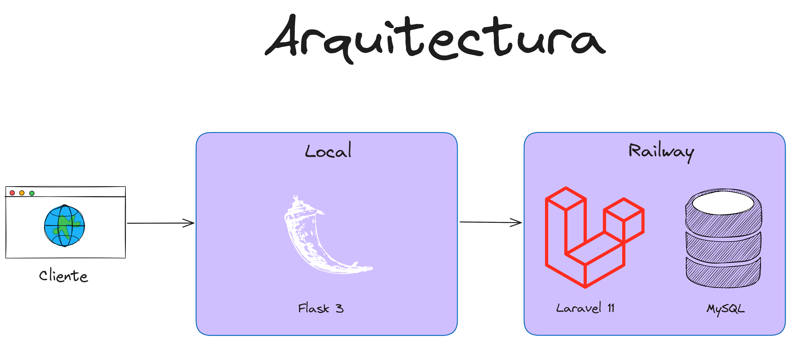

# App-Courses-Flask

Sistema web desarrollado como parte del curso de seminario en la carrera de Ingeniería de Software. Esta actividad tiene como objetivo principal implementar arquitecturas para la publicación y despliegue de sistemas en la nube.

## Arquitectura


## Despliegue de pruebas

Clonar el proyecto
```bash
git clone https://github.com/alexvegasdev/app-cursos-flask.git
```

Generar el entorno virtual
```bash
py -3 -m venv .venv
```

Activar el entorno
```bash
.venv\Scripts\activate
```

Instalar dependencias
```bash
npm install 
```

```bash
pip install -r requirements.txt
```

Iniciar el servidor de desarrollo
```bash
flask --app app run --debug
```

```bash
npx tailwindcss -i ./static/src/input.css -o ./static/dist/css/output.css --watch
```

## Habilitar envio de correos
Primero deberas ingresar a tu cuenta de google y crear una contraseña para aplicación. Esta la deberas insertar en las variables del archivo .env

```bash
cp .env.example .env
```
